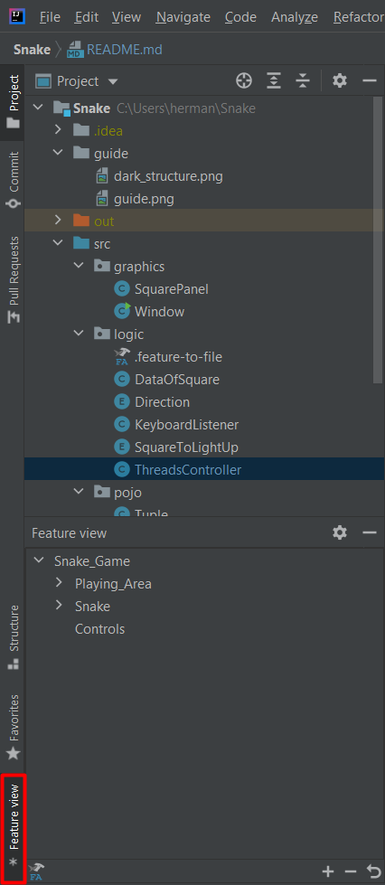
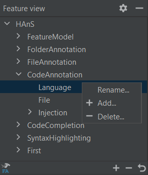

# Purpose:

The purpose of this repo is to test and evaluate the embedded feature annotations plugin
[HAnS](https://bitbucket.org/easelab/hans-text/src) for IntelliJ. 

HAnS-text supports:
* Feature Annotation Languages
    * Feature Model
    * Feature to folder
    * Feature to file 
    * Code annotations
* Syntax Highlighting
* Code Completion
* Feature View

## Embedded Feature Annotations

The usage of feature annotations is to map sections of code to functionality of the software. The system of annotations
that this plugin uses is able to map features to any file type and programming language (except languages that do not
have support for comments). The central part of this annotation system is a file with the extension ".feature-model".
This is a feature hierarchy model, describing feature names, and their hierarchy in textual form. These features may
then be references by mapping them to code.

### Feature Reference Names

Inside the feature hierarchy model, features with the same feature name may appear twice or more often. To reference
features uniquely the individual feature is pre-extended by its ancestor until the combined feature reference is unique
(separated by "::"). This technique is called Least-Partially-Qualified name, short LPQ.

```folderannotation
Feature_A::CommonFeatureName
Feature_B::CommonFeatureName
```

### Feature-to-code mapping

The feature-to-code mapping serves to link specific blocks and lines of code to one or more features. The parts of the
source code which are mapped to a certain feature are called annotation scopes. An annotation scope is surrounded by
annotation markers and contains at least one feature reference.

```java
// &begin[Feature_A]
private void example(){
        getAnotherExample(); // &line[Feature_B]
        }
// &end[Feature_A]
```

### Feature-to-file mapping

The feature-to-file mapping is a specialized file to map one or more file(s) and its/ their content to one or more
feature references. All content of the linked file is considered fully to be part of the given feature references. The
mapping file must be stored in the same folder as the source code files and covers only the file in this folder.

```fileannotation
FileNameA, FileNameB
FeatureA, Feature_B::Feature_C
```

### Feature-to-folder mapping

The purpose of this file is to map complete folders and their content to one or more feature references. The mapping of
feature references to folders allows linking specific features to the folder, including all its sub-folders and files.
With this, the mapping of complete folder structures to features is possible and may substitute the feature-to-file
mapping. The mapping file is located on the top level inside the to be annotated folder.

```folderannotation
Feature_A
Feature_B::Feature_C
```

### Feature View

The Feature View is a representation of the feature model tree structure. It is available as a tool window at the
bottom left of the display (see below). 



The Feature View supports adding, removing and renaming of features in the Feature Model.



## The Snake

A simple snake game in java, forked from [@hexadeciman](https://github.com/hexadeciman/Snake). Using Threads and Java
Swing to display the game. The code is well commented, if you have any questions or want to continue this project feel
free to do so 👌

### How it looks:


### Requirements:

* IntelliJ installed
* Recommended JDK 14
* Installed HAnS-text plugin

### Installation of the HAnS plugin:

* Open Plugins in Settings/Preferences. Click the settings icon and select "Install Plugin from Disk..."
  
* Choose the path to the zip file of the plugin.

